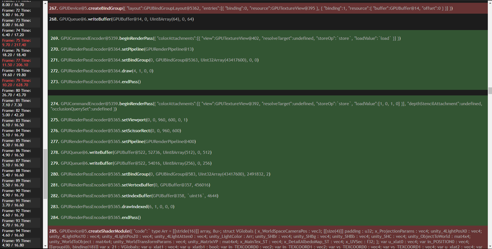

# WebGPU Profiler

> **Work In Progress**

WebGPU Profiler is a debugging tool for WebGPU.

It captures all WebGPU commands over a given number of frames, generating a report with all of the commands that were, as well as frame times.

## Load From Local Script Reference

Copy webgpu_profiler.js and webgpu_profiler.html to your project and load it by adding the following to your project's HTML.

```html
<script src="webgpu_profiler.js"></script>
<script>new WebGPUProfiler();</script>
```


